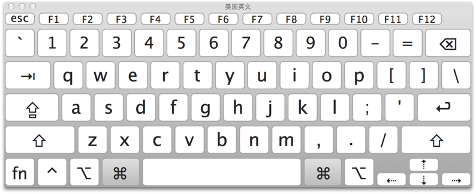

[//]: # (2017-07-19  other)
## mac使用的一些经验

### 1.截图
>* __Command＋shift＋3__:全屏截图，保存截图到桌面
>* __Command＋shift＋4__:鼠标选定区域截图，保存截图到桌面
>* __Command+shift+4+空格__:截图某个特定的活动窗口

### 2.键盘对应符号图


### 3.打开/关闭整个系统的隐藏文件
``` bash
defaults write com.apple.finder AppleShowAllFiles Yes && killall Finder
defaults write com.apple.finder AppleShowAllFiles No && killall Finder
```

### 4.创建txt文件
>* 在launchpad中找到__其他__>>__文本编辑__>>__新建__>>__偏好设置__>>格式修改为__纯文本__